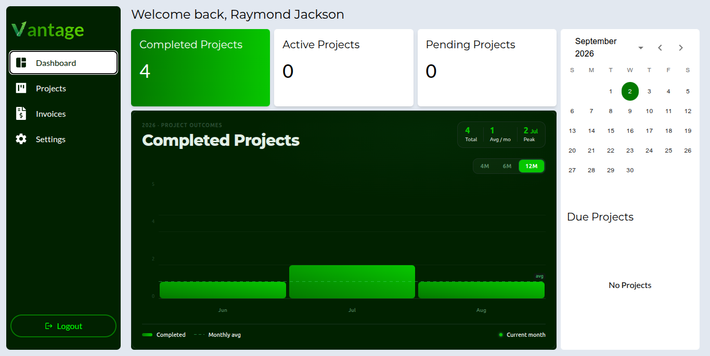
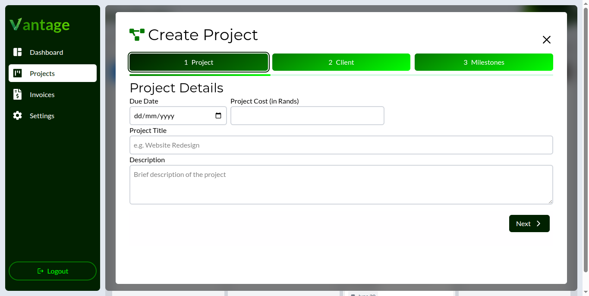
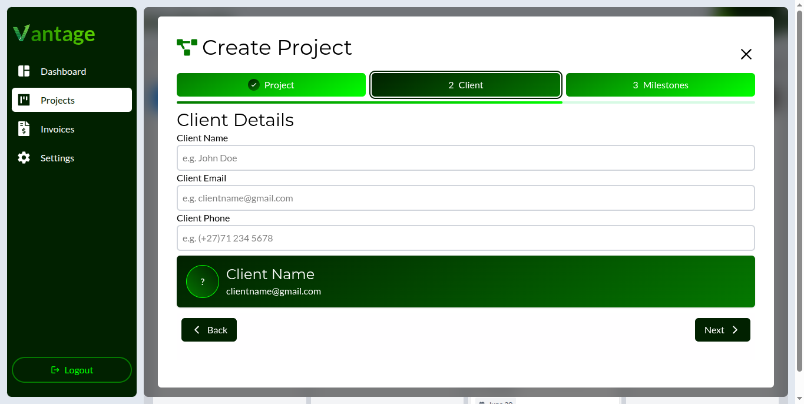
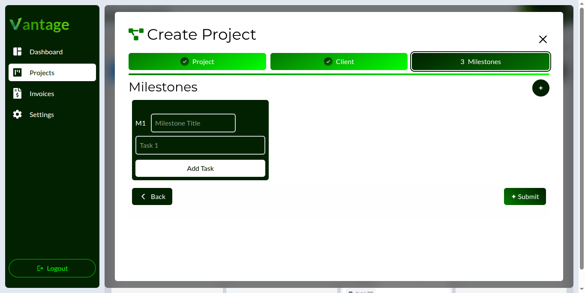
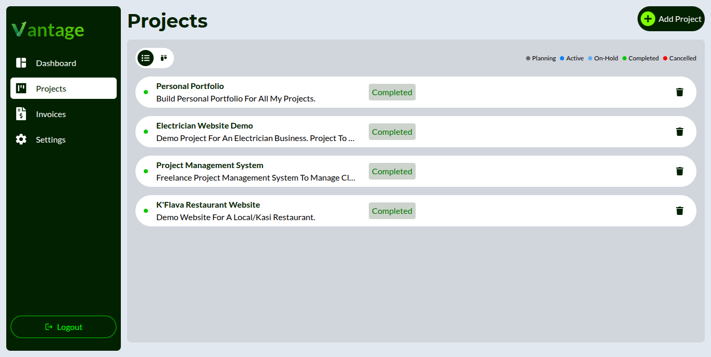
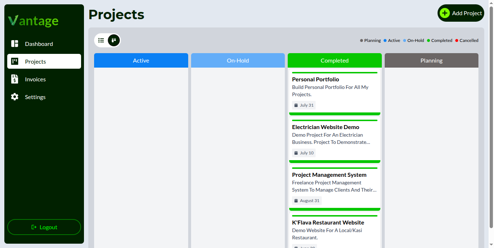
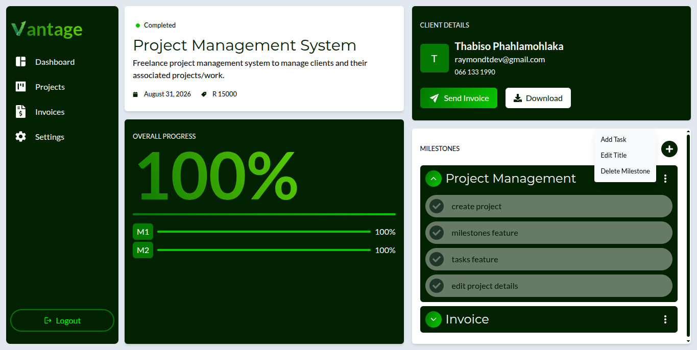
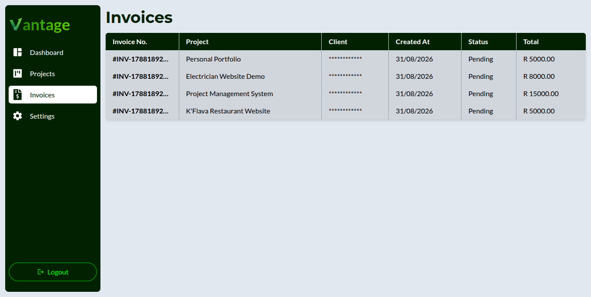
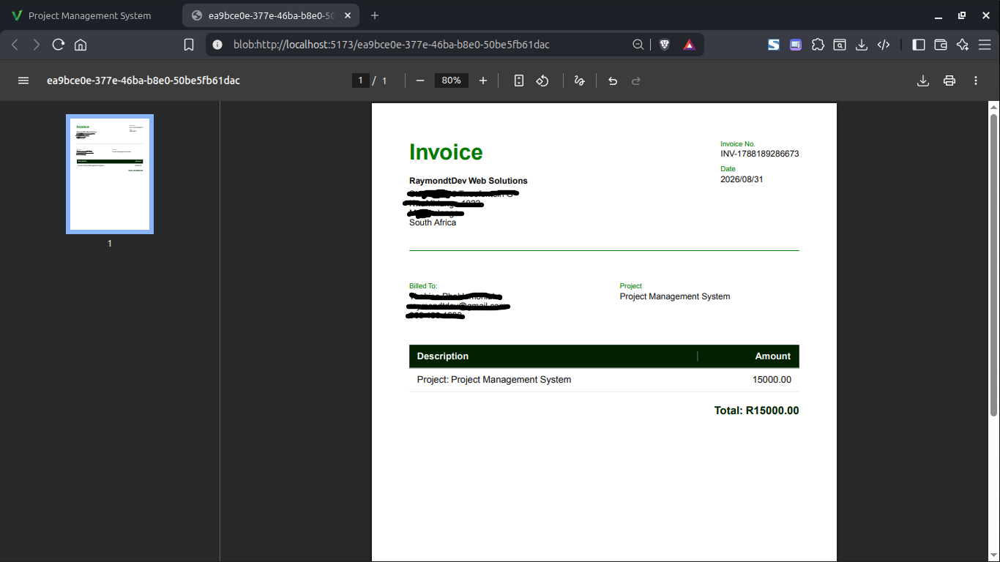

# Project Management System

# Features

Initially, I planned the project to only have basic CRUD features which would've made it akin to a task manager application. But as I kept on working, I ended up wanting to include features like invoice creation and generating a PDF for it. This part of the development was especially challenging because I had no clue how implement certain features (like creating a project and then its milestones and tasks simultaneously).

I ended up learing a lot of code implementations that will come in handy for projects I'll be building in the near future. I learned about MongoDB sessions and trasactions, that react can be used on the server to create PDF documents, and how do use Blobs to download/view a document that was created on the server.

## Dashboard

## Project Creation

<table style="border: none; width: 100%">
  <tr>
    <td colspan="2"></td>
  </tr>
  <tr>
    <td></td>
    <td></td>
  </tr>
</table>

## Projects List

<table>
  <tr>
    <td></td>
    <td></td>
  </tr>
<table>

## Project Details

## Invoices

## Invoice PDF

